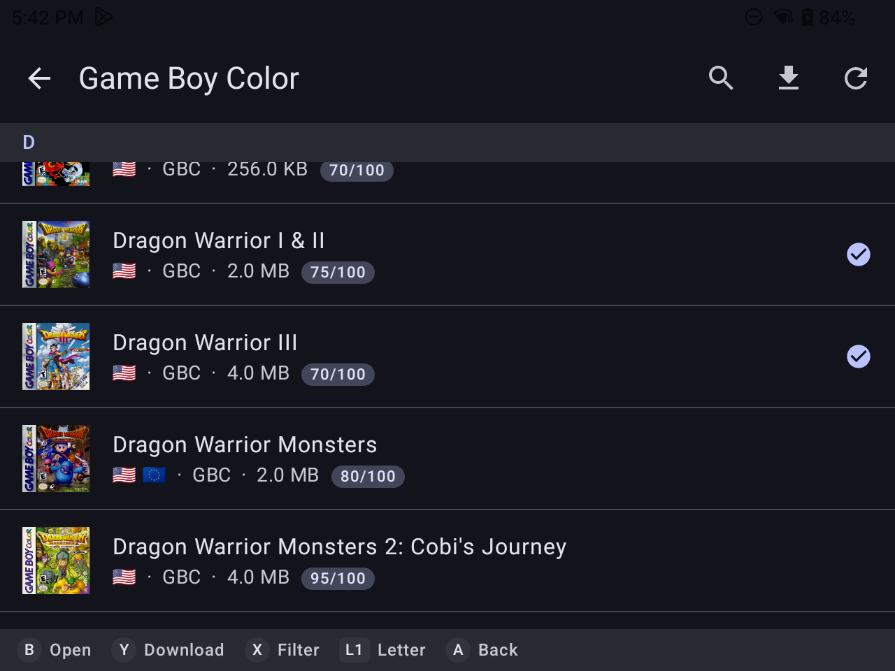

# RomMDroid



A lightweight Android client for [RomM](https://github.com/rommapp/romm)
focused on downloading games to your device's ROM collection.

## Features

- Browse and search platforms and collections in your ROM library
- Download ROMs directly to per-platform folders
- Built with Android gaming handhelds in mind, so full controller support

## Development

### Nix

If you are brave, there's a nix flake based development environment available:

```bash
# Enter the dev shell (installs JDK 21, Android SDK, Gradle, openapi-generator-cli, adb)
nix develop

# Or with Android Studio:
nix develop .#withStudio
android-studio
```

The shell hook sets `ANDROID_SDK_ROOT`, `ANDROID_HOME`, and `JAVA_HOME` automatically.
Copy `local.properties.example` to `local.properties` - Android Studio will pick up the SDK path
from the environment variables set by the flake.

### Building

```bash
# Debug APK
gradle assembleDebug

# Install to connected device
gradle installDebug

# Or via Nix (produces rommdroid-debug.apk in result/)
nix build
```

## Acknowledgements

- This is essentially an Android version of the wonderful
[Grout](https://grout.romm.app/) for Linux handhelds.

## LLM Usage

Apart from this README, which was written by a human, everything was created by Claude. Apologies for the terrible code quality, overly verbose comments and commit messages, em-dashes, etc.

## License

MIT
